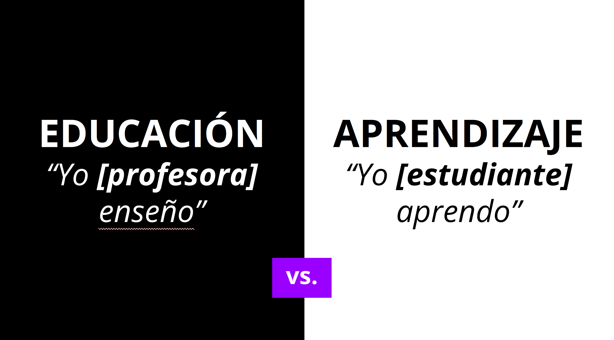
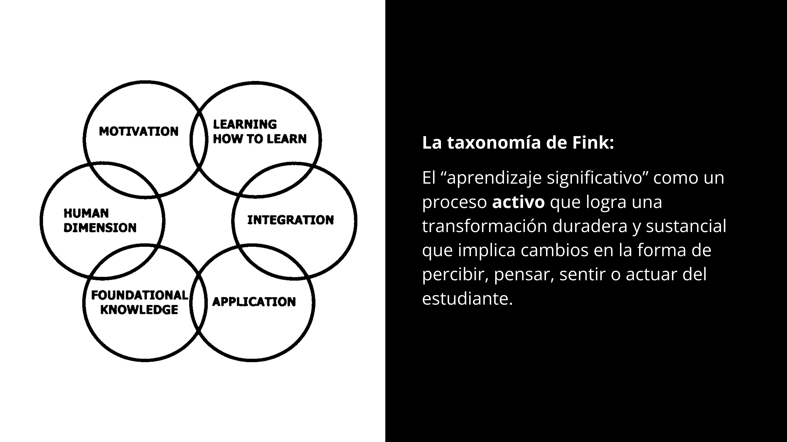

# 2. Metodología de aprendizaje

**Tiempo de lectura** :stopwatch:: 10min

A la gran mayoría nos educaron para seguir instrucciones, a callar mientras un profesor hablaba y hablaba, a memorizar, sin saber por qué ni para qué, una lista de cosas que debíamos responder en un examen que cuantificaba nuestro “conocimiento” y que nos clasificaba en un ranking de mejores y peores, comparándonos como si fuéramos ladrillos idénticos; una atroz negación de nuestra multidimensional e infinita diversidad. **Nuestros talentos individuales quedaron, muchas veces, ocultos para siempre por estar “fuera de la norma” o “muy lejos del centro de la campana de Gauss".**

> Los tres pilares de esta experiencia de aprendizaje son: autodirigido con guía, colaboración entre estudiantes, y a tu ritmo.

## Tú, estudiante, eres el centro

Nuestro modelo de aprendizaje cambia el tradicional paradigma de “yo te enseño” a “yo aprendo”. Ya hemos hablado de la importancia del desarrollo de habilidades de largo plazo como aprender a aprender para acceder a trabajos que no están en desaparición.

Sea cual sea el tiempo que pases aquí, esperamos que te lleves una experiencia que te sume para trabajar en entornos de incertidumbre en los que ya no se necesita  planificar y ejecutar las mismas tareas, pero sí aprender constantemente y adaptarse al cambio permanente.

¿Por qué tenemos que aprender lo mismo a la misma vez?, ¿por qué no podemos aprender desde siempre a tomar decisiones conscientes sobre nuestro aprendizaje y hacernos cargo de ellas?, ¿qué tiene de extraordinario que cada quien aprenda a su ritmo?, ¿no es parte de la vida saber lidiar con que tenemos habilidades diferentes?, ¿no es la autonomía una habilidad esencial para trabajar y vivir, y que deberíamos ejercitar tanto como podamos?

## La única manera de aprender, es hacer lo que no sabes

Conocer algo no es lo mismo que tener una destreza para hacer algo. Saber de la ley de la gravedad y del movimiento no hace que sepa andar en bicicleta.

De la educación tradicional, muchas veces hemos quedado con la idea de que "recordar" para responder un cuestionario es lo más importante. Si bien eso puede ser valioso para muchos contextos y situaciones, aquí proponemos que eso deben ser insumos para el real objetivo que es desarrollar habilidades. Debes ser capaz de hacer algo concreto y real con lo que has aprendido.

Por eso, en lugar de que tengas "contenido" o "materia" que debes leer y memorizar para luego responder un cuestionario, para luego hacer un ejercicio, el vehículo para aprender serán los **retos**. En cada reto encontrarás el requerimiento de lo que debes lograr **hacer** y, todos los insumos necesarios para adquirir el conocimiento necesario,  ponerlo en práctica para lograr lo que se requiere, y autoevaluar tu trabajo. 

## Vas a dudar pero recuerda que el aprendizaje no es lineal

Te vas a sentir atascada, confundida, "tonta", frustrada, vas a querer salir corriendo y decir "esto no es para mí". Ten paciencia, confía en la manera que te proponemos para aprender. 

Hablar de "inteligencia" es polémico y no queremos entrar en ese terreno, sí queremos que sepas que consideramos que 

Si consigues sintonizar, te llevarás una experiencia transformadora.

##Además, ¡no te olvides que estarás rodeada de mujeres con perfiles diversos que estarán aprendiendo también! La comunidad que se genere entre compañeras será una pieza clave en tu experiencia de aprendizaje. 

## Aprendizaje auto-dirigido

## Aspecto social del aprendizaje

## Preguntas frecuentes

---

:seedling: Range, WEF

---
