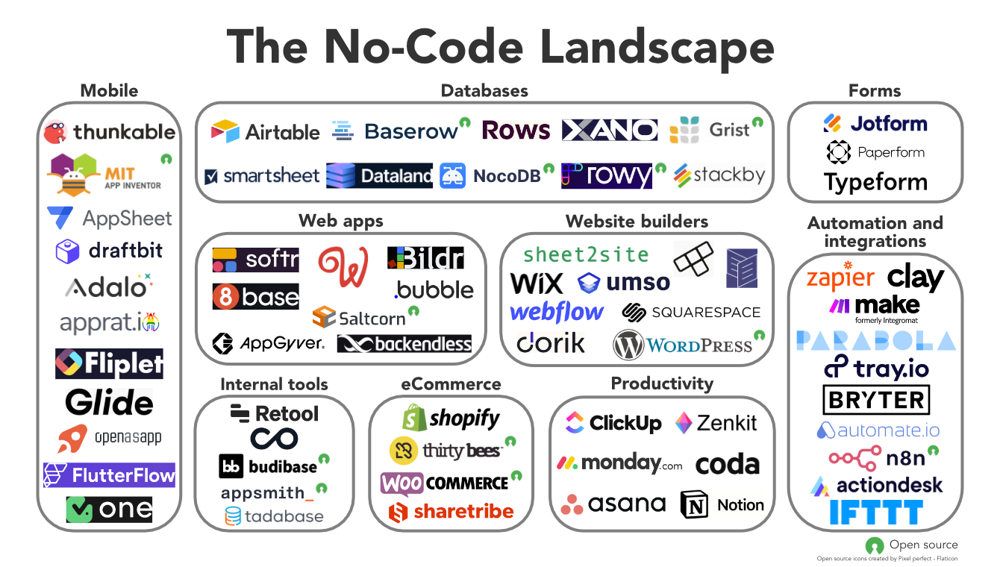

# ◾Qué es el No-Code

**Dificultad:** 🌻

**Aprendizaje:** 🍯

**Tiempo:** ⏱ 45min

## Introducción

El **no-code**, en castellano "sin código" es un concepto amplio respecto a un enfoque de desarrollo de *software* y todo tipo de soluciones digitales que permite a personas sin conocimientos técnicos en programación crear aplicaciones web, móviles, automatizar procesos usando herramientas visuales e interfaces intuitivas, etc. En lugar de escribir código, las personas interactúan con componentes preconstruidos y configuraciones para construir soluciones personalizadas de diversa índole.

Cabe distinguir del concepto de **low-code** (poco código) que, a diferencia del no-code, que está diseñado para usuarias sin experiencia en programación, el low-code está dirigido a desarrolladoras que tienen conocimientos de programación al menos básicos, y buscan acelerar el proceso de desarrollo. Así, el low-code combina componentes visuales con fragmentos de código personalizado para ofrecer una mayor flexibilidad y control sobre el desarrollo de aplicaciones. Esto permite crear soluciones más complejas y personalizadas que las que típicamente se pueden lograr con no-code.

## **¿Por qué es importante el no-code?**

La cantidad inmensa de necesidades de creación de productos, servicios, soluciones digitales en general, automatizaciones de procesos manuales, etc. supera largamente la cantidad de profesionales *developers* capaces de satisfacer tal demanda de trabajo.

Gracias a la inmensa proliferación de herramientas "no-code" y AI, hoy es posible resolver una gran cantidad de esas necesidades "sin saber programar". Como discutimos en [La transformación del trabajo y las oportunidades](../../curriculum_model/lea_model_02_work.md) , muchos empleos tradicionales están desapareciendo aceleradamente, dando paso a nuevas oportunidades que requieren conocimientos y habilidades digitales concretas. Aprender herramientas de **no-code** e **inteligencia artificial (IA)** no sólo abre puertas a estos nuevos empleos, sino que también permite a las personas crear soluciones innovadoras y adaptarse a los cambios del mercado laboral.

## **Algunos aspectos importantes:**

1. **Democratización**: Permite a cualquier persona, independientemente de su experiencia técnica, crear aplicaciones y automatizaciones.
2. **Empoderamiento**: Empodera a los equipos no técnicos, como *marketing*, *ventas* y servicios, etc. para resolver problemas específicos sin depender de alguien de "TI".
3. **Velocidad**: Facilita el desarrollo rápido de prototipos y soluciones sin necesidad de  ciclos largos de desarrollo.
4. **Costo vs. efectividad**: En general, el costo de las herramientas es "bajo" respecto al valor que se puede obtener de las soluciones que permiten implementar. 

## **¿Cómo Funciona el No-Code?**

1. **Interfaces Visuales**: Usan editores del tipo arrastrar y soltar (drag-and-drop) para añadir y organizar componentes.
2. **Plantillas y Componentes Preconstruidos**: Ofrecen módulos listos para usar que pueden ser personalizados según las necesidades de la usuaria.
3. **Integraciones**: Conectan diversas aplicaciones y servicios mediante APIs y conectores predefinidos para:
   1. Intercambiar datos.
   2. Automatizar flujos de trabajo que se disparan automáticamente en respuesta a ciertos eventos o condiciones.

### **Ventajas y Limitaciones**

- **Ventajas**:
  
  - **Facilidad de Uso**: No requiere conocimientos de programación.
  - **Velocidad de Implementación**: Soluciones rápidas y eficientes.
  - **Flexibilidad**: Fácil de modificar y escalar según las necesidades.

- **Limitaciones**:
  
  - **Personalización Limitada**: Puede no ser tan flexible como el desarrollo a medida.
  - **Dependencia de la Plataforma**: Posible dependencia de un proveedor específico.
  - **Escalabilidad**: Puede tener limitaciones en proyectos muy grandes o complejos.

## **Conclusión**

El no-code está revolucionando la forma en que las personas y las empresas abordan el desarrollo de *software*, democratizando el acceso a la tecnología y permitiendo la creación rápida y eficiente de soluciones personalizadas. Aunque no reemplaza completamente a la programación tradicional, ofrece una alternativa poderosa para muchas aplicaciones y casos de uso, especialmente cuando se necesita rapidez y simplicidad.

---

## Actividad

Considerando como referencia inicial algunos de los ejemplos previo, identifica 1 necesidad u oportunidad concreta que hayas tenido cerca recientemente y que sabes o intuyes que se podría resolver con herramientas no-code. Piensa en algo que ahorraría tiempo de trabajo manual y/o dinero aportando  valor como solución.

Luego busca alguna(s) herramienta(s) no-code que crees que te hubieran ayudado.

### **Comparte de la siguiente manera:**

**En mi** (elije 1)

`[trabajo | emprendimiento | negocio familiar | etc.]`, 

**Se necesitaba** (elije 1)

`[automatizar un proceso | crear un website | analizar datos | etc.]` .

**Hacerlo me hubiera significado** (elije 1)

`[ahorrar trabajo manual | que me consideren mejor | acceder a más oportunidades | etc.]` 

Por ejemplo:  En mi **trabajo**, se necesitaba **automatizar** el envío de correos con una plantilla cada vez que se agregaba una fila a una hoja de cálculo con datos de un cliente. Hacerlo me hubiera significado **demostrar que soy capaz de hacer mucho más y acceder a alguna oportunidad de mejora de mi rol o condiciones de trabajo.**

Agrega cualquier otro comentario o aspecto que quieras y te parezca relevante.

## Insumos adicionales para tu aprendizaje:

- Dr. Google (siempre)

- AI: ChatGPT, Gemini, Perplexity, Bing, etc.. Recuerda que pueden alucinar y mentirte descaradamente, verifica siempre.

- [No code y low code ¿son tendências em programaçión? #shorts - YouTube](https://youtube.com/shorts/eTdNR2bPKpI?si=xqP3jeCq4bIRyND9)

- [No-code vs Low-code vs Code... (y por qué tu trabajo está en riesgo) - YouTube](https://youtu.be/_Du-nvEKKRM?si=xJzv_aZa4txaBVQQ)

## Guía de Autoevaluación

No habrás cumplido con la actividad si:

- [x] No identificaste una oportunidad real en tu contexto para aplicar el enfoque no-code.
- [x] No comentas en el hilo de Discord

---

> :mega: Al terminar, [**regresa a Discord**](https://discord.com/channels/1209273049304666113/1253005244103917679) , 💬 Comparte en el hilo siguiendo el formato propuesto y reacciona con ✅ para marcar tu progreso.

---
