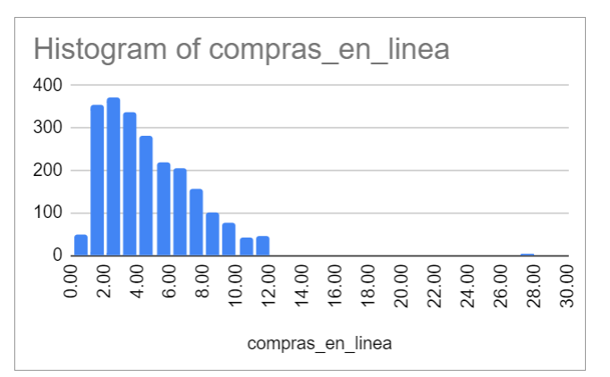

# ◾Reto 2.2: Conociendo la distribución de los datos

**Dificultad:** 🌻

**Aprendizaje:** 🍯🍯

**Tiempo:** ⏱⏱ 2-4 hrs.

**Reacciona** con :eyes: en Discord cuando comiences la lectura y/o actividad.

## Meta de Aprendizaje

Aprenderás a interpretar el concepto de distribución de los datos mediante la creación de histogramas que comuniquen visualmente la distribución.

## Descripción

Comprender la distribución de las variables "compras en línea" y "compras en tienda" te permite identificar patrones y tendencias en los comportamientos de compra, lo que es fundamental para la toma de decisiones de negocio. Construye un histograma para visualizar estas distribuciones y relaciona estos gráficos con la media y la mediana para entender mejor la centralidad y la dispersión de los datos. 

### Cumples con la meta de aprendizaje si:

- [x] Creas un histograma para cada variable.
- [x] Interpretas correctamente los conceptos (pregunta a tus compañeras o en las sesiones en vivo de ayudantía).

## Insumos para tu aprendizaje

- [Concepto de histograma](https://docs.google.com/document/d/1-0USmtgZ1-mBw6G_E8OIoCkdvfjFDAeMJf28_gtNF9U/edit?usp=sharing).
- [Video cómo crear un histograma](https://www.youtube.com/watch?v=3fD_nqhQILA) 

## Pauta de trabajo

- Aplica a la misma variable que aplicaste las medidas de tendencia central y compara los resultados.

- Eres libre de explorar y analizar los datos como desees.

- **Asegúrate de comprender lo que estás haciendo.** No te limites solo a responder las preguntas planteadas; analiza, prueba, etc.

- No temas experimentar y jugar con los datos.

Aquí tienes un ejemplo de histograma para la variable compras en linea:

- Como vimos en el reto anterior, el promedio está siendo influenciado por un valor alto que hace que el promedio sea mayor que la mediana, y que el histograma tenga una cola hacia la derecha.

Estos gráfico puede servirte de referencia para verificar que tus cálculos y análisis son correctos.

¡Diviértete y disfruta del proceso de aprendizaje! Recuerda que sentirse aturdido y confundido es una parte natural del proceso.

---

> - 💡 Evaluación: Recuerda que puedes pedir la [evaluación de una compañera](../curruculum_model/lea_model_06_assessment.md) antes de terminar tu reto y compartir la URL.
> 
> - :mega: Al terminar, [**regresa a Discord**](https://discord.com/channels/1209273049304666113/1209888657507487744) , 💬 Comparte el enlace a tu trabajo en el hilo y reacciona con ✅ para marcar tu progreso. No olvides dejar el enlace público para que tus compañeras puedan verlo.

---
