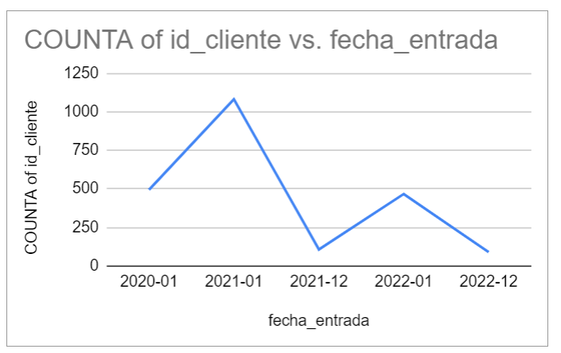

# ◾Reto 3.1: Visualizar datos a lo largo del tiempo

**Dificultad:** 🌻

**Aprendizaje:** 🍯🍯

**Tiempo:** ⏱⏱ 1-2 hrs.

**Reacciona** con :eyes: cuando comiences la lectura y/o actividad.

## Meta de Aprendizaje

Aprenderás crear e interpretar los datos a lo largo del tiempo a través de gráficos de línea.

## Descripción

Utiliza la variable "fecha_entrada" para comprender el patrón de registro de nuevos clientes. Este análisis te permitirá identificar las épocas del año, meses o días específicos en los que se registran más clientes, lo cual es vital para estrategias de marketing y planificación de recursos, stock, etc. del negocio. Además, emplea esta fecha para identificar otros patrones presentes en los datos, como picos de actividad, tendencias estacionales o anomalías. 

### Cumples con la meta de aprendizaje si:

- [x] Creas un gráfico de líneas.
- [x] Interpretas correctamente el gráfico (pregunta o asiste a las sesiones en vivo de ayudantía).

## Insumos para tu aprendizaje

- [Video sobre gráficos de líneas](https://www.youtube.com/watch?v=HXYZRCWfV7M)

## Pauta de trabajo

- Primero, resume los datos con una tabla dinámica para contar la cantidad de clientes por fecha de registro (fecha_entrada). Luego, utiliza esta tabla para crear un gráfico de líneas.

- Eres libre de explorar y analizar los datos como desees.

- **Asegúrate de comprender lo que estás haciendo.** No te limites solo a responder las preguntas planteadas; analiza, prueba, etc.

- No temas experimentar y jugar con los datos.

Prueba crear una columna con el año y el mes utilizando las fórmulas CONCATENATE, YEAR y MONTH para visualizar el gráfico de esta manera:

¡Diviértete y disfruta del proceso de aprendizaje! Recuerda que sentirse aturdido y confundido es una parte natural del proceso.

---

> - 💡 Evaluación: Recuerda que puedes pedir la [evaluación de una compañera](../curruculum_model/lea_model_06_assessment.md) antes de terminar tu reto y compartir la URL.
> 
> - :mega: Al terminar, [**regresa a Discord**](https://discord.com/channels/1209273049304666113/1209888657507487744) , 💬 Comparte el enlace a tu trabajo en el hilo y reacciona con ✅ para marcar tu progreso. No olvides dejar el enlace público para que tus compañeras puedan verlo.

---
