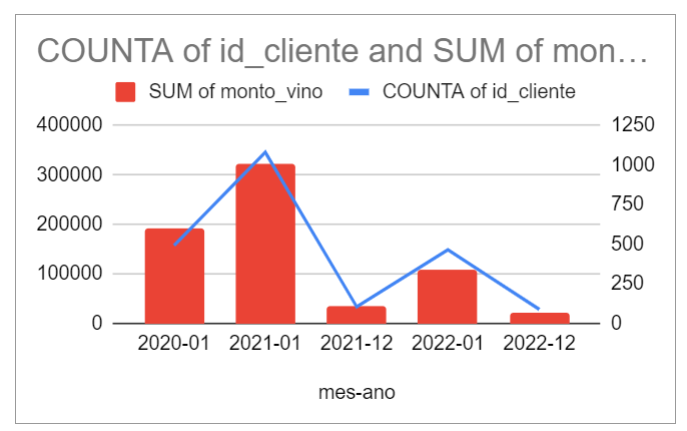

# ◾Reto 3.1: Visualizar datos con gráficos combinados

**Dificultad:** 🌻

**Aprendizaje:** 🍯🍯

**Tiempo:** ⏱⏱ 1-2 hrs.

**Reacciona** con :eyes: cuando comiences la lectura y/o actividad.

## Meta de Aprendizaje

Aprenderás a crear e interpretar los datos combinando diferentes conjuntos de datos en un solo gráfico. 

## Descripción

Utiliza la variable "fecha_entrada" para entender el patrón de registro de nuevos clientes. Este análisis te ayudará a identificar tendencias temporales y patrones en el registro de nuevos clientes. Esta vez, crea un gráfico combinado que incluya el total de compras realizadas por los clientes en la tienda. Al combinar estos datos en un solo gráfico, podrás visualizar la relación entre el registro de nuevos clientes y sus comportamientos de compra. Este tipo de comprensión permitirá a cualquier negocio tomar decisiones informadas y racionales.

### Metas de Aprendizaje

- [x] Creas un gráfico combinado.
- [x] Interpretas correctamente el gráfico (pregunta o asiste a las sesiones en vivo de ayudantía).

## Insumos para tu aprendizaje

- [Video sobre gráficos combinado](https://www.youtube.com/watch?v=jBVPCobW-do)

## Pauta de trabajo

- Primero, resume los datos con una tabla dinámica para contar la cantidad de clientes por fecha de registro (fecha_entrada) y la suma de compras en la tienda. Luego, utiliza esta tabla para crear un gráfico combinado, donde la línea representa la cantidad de clientes y las columnas muestran la suma de compras en la tienda.

- Eres libre de explorar y analizar los datos como desees.

- **Asegúrate de comprender lo que estás haciendo.** No te limites solo a responder las preguntas planteadas; analiza, prueba, etc.

- No temas experimentar y jugar con los datos.

Este es un ejemplo de gráfico combinado que muestra la suma de compras de vino según los clientes con fecha de entrada en el mismo mes y el total de clientes que se registraron en ese mes:

¡Diviértete y disfruta del proceso de aprendizaje! Recuerda que sentirse aturdido y confundido es una parte natural del proceso.

---

> - 💡 Evaluación: Recuerda que puedes pedir la [evaluación de una compañera](../curruculum_model/lea_model_06_assessment.md) antes de terminar tu reto y compartir la URL.
> 
> - :mega: Al terminar, [**regresa a Discord**](https://discord.com/channels/1209273049304666113/1209888657507487744) , 💬 Comparte el enlace a tu trabajo en el hilo y reacciona con ✅ para marcar tu progreso. No olvides dejar el enlace público para que tus compañeras puedan verlo.
> 
> - Comenta brevemente una interpretación del gráfico combinado.

---
