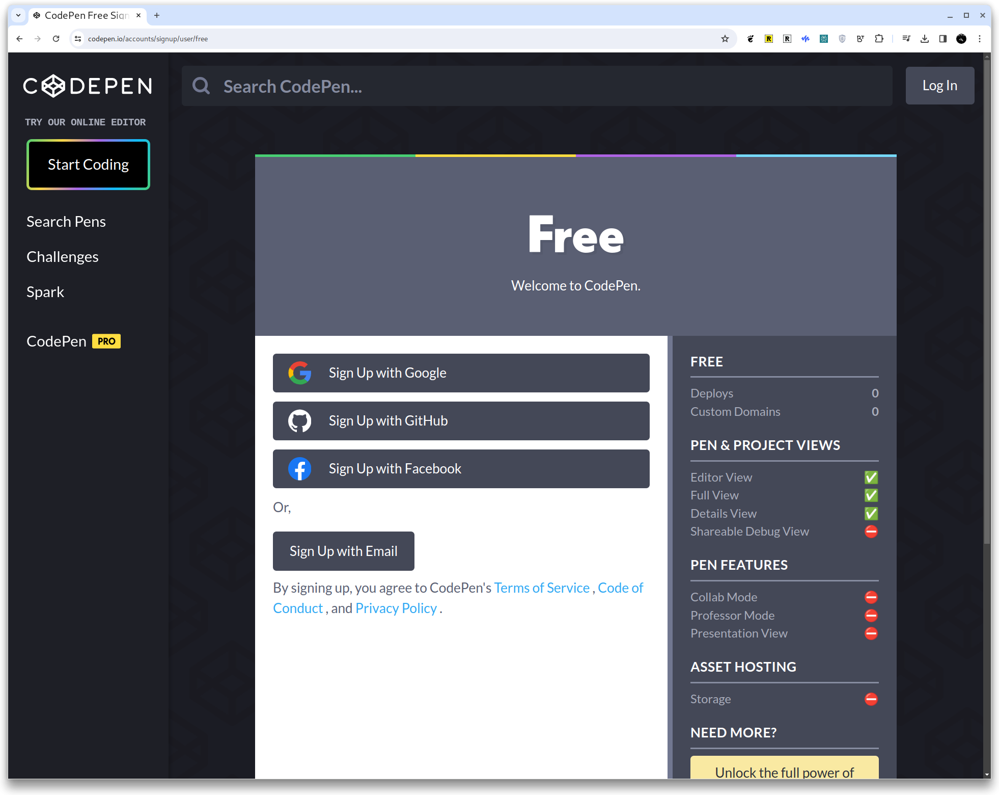
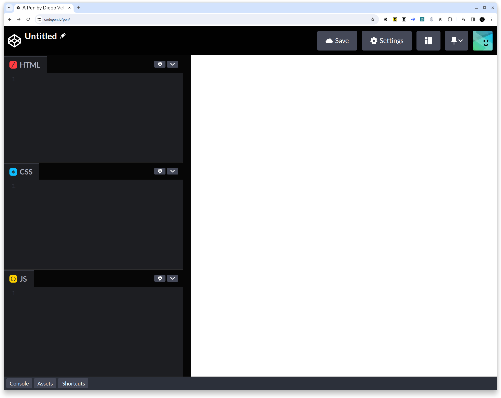
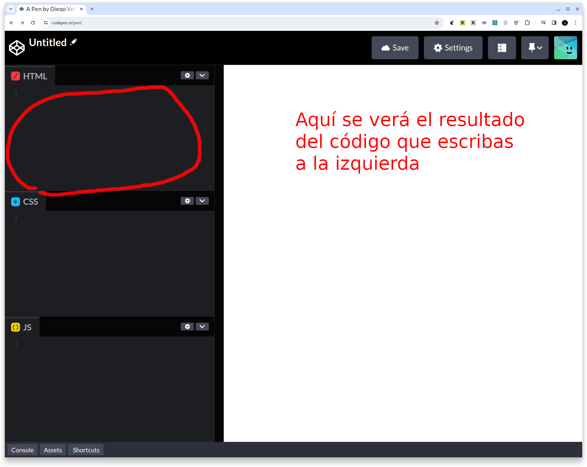
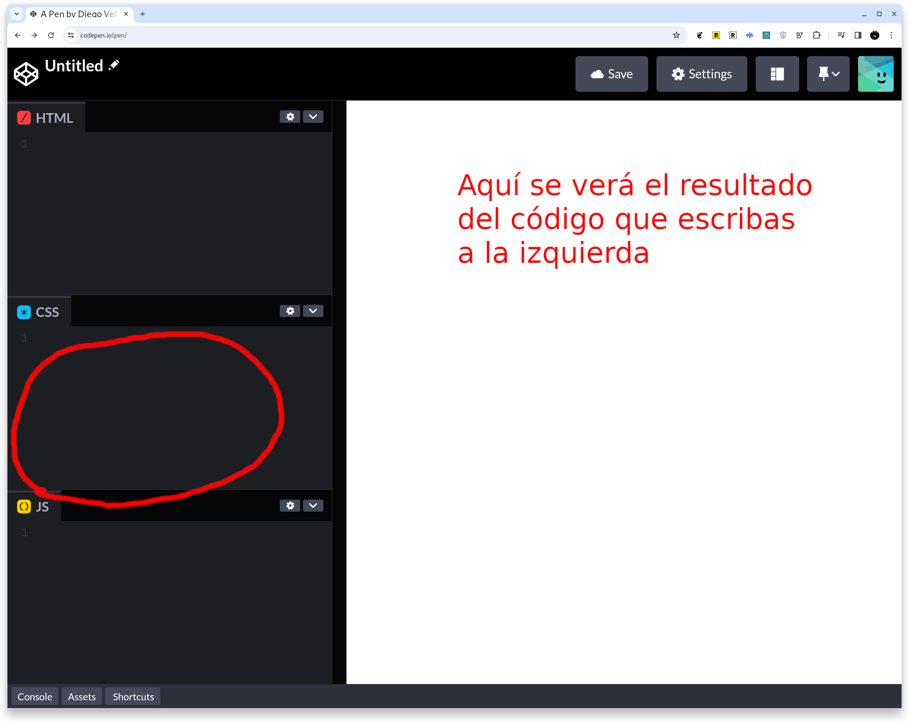
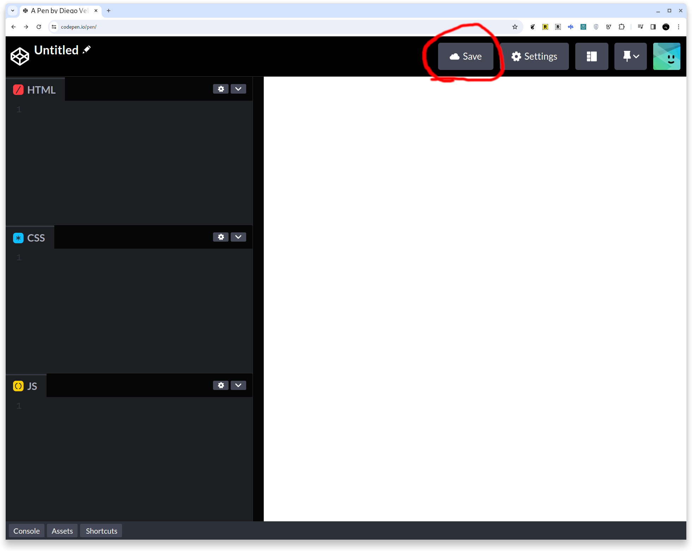
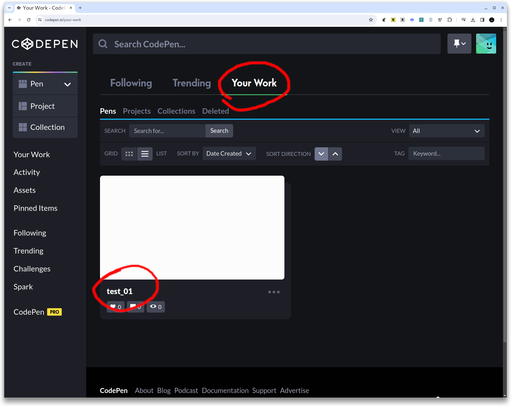
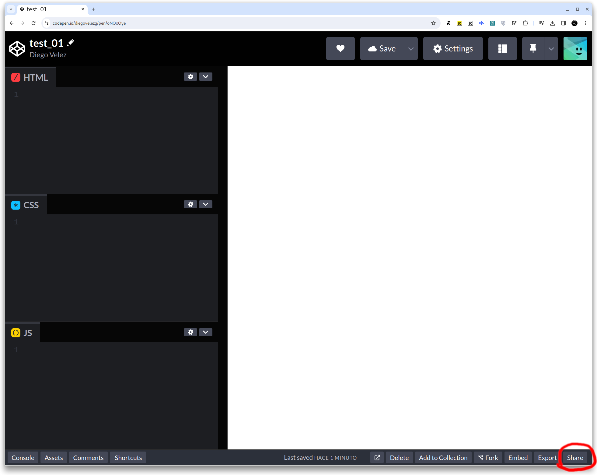
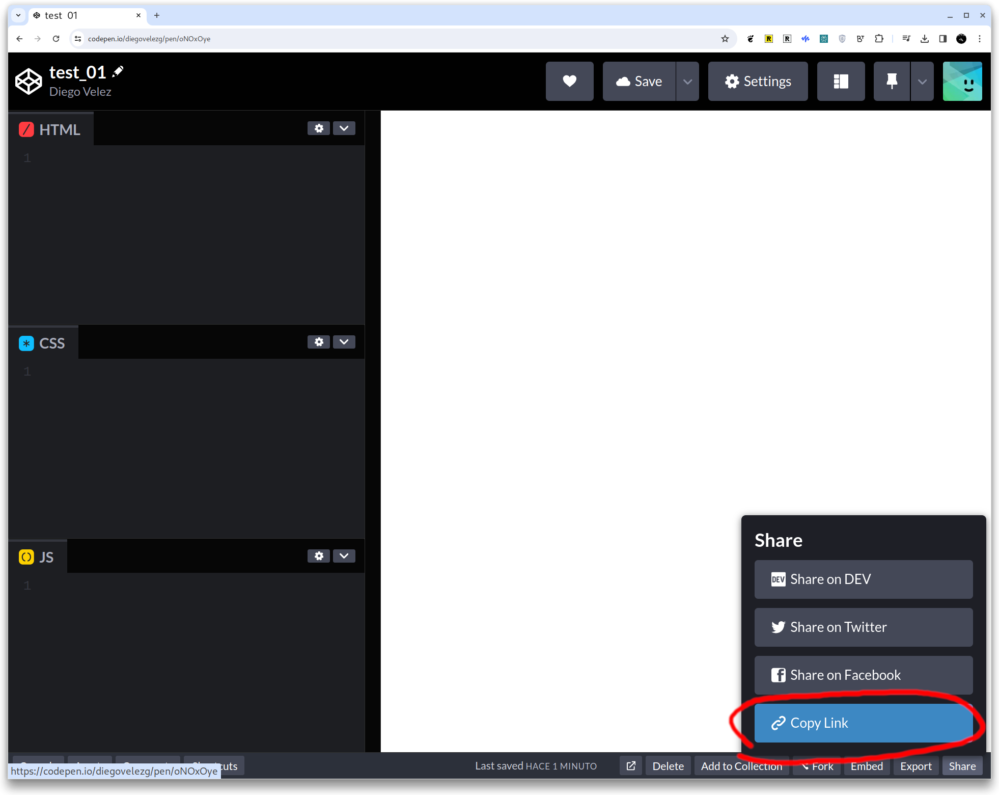

# CodePen

## Editores de código

Los editores de código son herramientas esenciales para cualquier persona que trabaje en el desarrollo y la programación de *software*. Estos editores están diseñados para facilitar la escritura y edición de código, ofreciendo características como resaltado de sintaxis, autocompletado y depuración de errores, etc. Existen muchas opciones, desde simples editores de texto hasta entornos de desarrollo integrados (IDE) completos, cada uno con sus propias fortalezas y orientados a distintos niveles de experiencia y necesidades específicas.

Un Entorno de Desarrollo Integrado (IDE, por sus siglas en inglés) es una aplicación de *software* que proporciona a las desarrolladoras una suite completa de herramientas de programación en un solo paquete. Un IDE típicamente incluye un editor de código, herramientas de construcción y depuración, y a menudo integra gestores de control de versiones. Esto facilita no solo la escritura del código, sino también su prueba, depuración, mantenimiento, y colaboración con otras personas, todo en un solo lugar.

## CodePen

Para lAs principiantes, comenzar con herramientas innecesariamente complejas puede ser abrumador y contraproducente. Por eso, recomendamos iniciar CodePen. CodePen es una herramienta en línea que permite a los usuarios experimentar con HTML, CSS y JavaScript directamente desde el navegador, sin la necesidad de instalar *software* adicional. Es ideal para aprender y probar código en tiempo real, con la ventaja de poder compartir tus proyectos y ver los de otras, lo cual es una excelente manera de inspirarse y aprender de la comunidad. A medida que ganes confianza y experiencia, podrás explorar editores de código más avanzados y descubrir cuál se adapta mejor a tus proyectos y estilo de trabajo.

### Crea tu cuenta

Anda al sitio de [CodePen](https://codepen.io/) y crea tu cuenta. A Muchas veces es útil crear con tu cuenta de Google (por ejemplo).

### Crea tu primer "Pen"

En CodePen, se le llaman "Pen" a un proyecto individual que consta de HTML, CSS, y JavaScript. Es básicamente un entorno de desarrollo en línea donde puedes escribir, probar y demostrar fragmentos de código.

Cuando estés lista para comenzar a "codear", crea tu primer "Pen" 

## Tu primer Pen

Así se verá tu primer "proyecto" completamente en blanco.

Ponle un nombre para que te sea fácil identificar qué harás acá.

### HTML

Este espacio es donde escribirás tu código HTML

### CSS

Y acá escribirás tu código CSS.

### Guarda tu primer "Pen"

### Todos tus "Pens"

A partir de ahora, acá encontrarás todos los "Pens" que hayas creado.

### Comparte tu trabajo

Cuando quieras compartir tu trabajo para mostrar el resultado o pedir comentarios/ayuda de alguna compañera, debes obtener el enlace/*link* al "Pen"

¡Listo!
