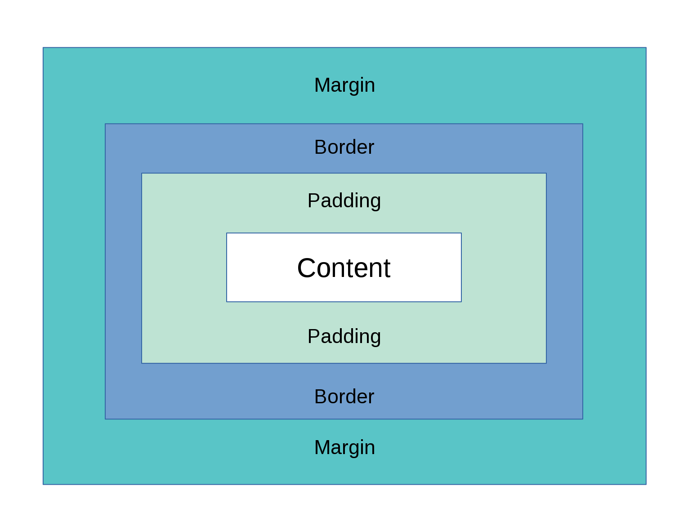

## CSS: Fundamentos y ejemplos

Ahora profundizaremos en algunos de los conceptos esenciales de CSS que son fundamentales. Abordaremos el modelo de caja, explicando cómo se estructura y se distribuye el espacio alrededor de los elementos. Luego, examinaremos las propiedades `margin` y `padding` para gestionar los espacios internos y externos de los elementos. También exploraremos cómo aplicar estilos al texto y las fuentes tipográficas para mejorar la legibilidad y estética. A continuación, veremos cómo usar colores e imágenes de fondo para darle vida a tus páginas. Finalmente, aprenderemos a estilizar enlaces y a añadir transiciones para una mejor experiencia de usuario.

### Pixeles

En CSS, los píxeles (`px`) son una unidad de medida comúnmente utilizada para definir el tamaño y las dimensiones de elementos, como anchos, altos, márgenes, rellenos y fuentes. Un píxel representa un punto en la pantalla y proporciona precisión en el diseño, asegurando que los elementos se vean de la misma forma en diferentes dispositivos y resoluciones. Sin embargo, para diseños más flexibles y adaptables, también se utilizan otras unidades como porcentajes, `em`, `rem`, y unidades relativas a la ventana gráfica (`vw`, `vh`).

### Modelo de Caja



El modelo de caja en CSS es crucial para entender cómo se distribuye el espacio alrededor de los elementos en una página web. Cada elemento se considera una caja que consiste en cuatro áreas:

1. **Contenido**: El área donde reside el contenido del elemento.
2. **Relleno (Padding)**: El espacio entre el contenido y el borde.
3. **Borde (Border)**: El borde que rodea el relleno y el contenido.
4. **Margen (Margin)**: El espacio fuera del borde, separando el elemento de otros elementos.

```css
div {
  width: 200px;
  padding: 20px;
  border: 5px solid black;
  margin: 10px;
}
```

En este ejemplo, la caja del `div` tiene un ancho de 200px, un relleno de 20px, un borde de 5px y un margen de 10px.

> :robot: **IA Tip:** "Estoy aprendiendo lo básico de CSS. Dame un ejemplo de código HTML y CSS que contenga 3 secciones con distintos estilos según el 'modelo de caja'. Incluye una breve explicación."

## Propiedades fundamentales

### Margin y Padding

`margin` y `padding` son propiedades que controlan el espacio fuera y dentro de los elementos, respectivamente.

- **Margin**: Espacio exterior que separa un elemento de otros.
- **Padding**: Espacio interior entre el contenido y el borde del elemento.

```css
p {
  margin: 20px;
  padding: 10px;
}
```

En este ejemplo, los párrafos (`<p>`) tendrán un margen de 20px alrededor y un relleno de 10px dentro de sus bordes.

### Estilos de Texto y Fuentes Tipográficas

CSS proporciona una variedad de propiedades para estilizar el texto y las fuentes. Algunas de las más comunes incluyen:

- `font-family`: Define la fuente del texto.
- `font-size`: Establece el tamaño de la fuente.
- `color`: Cambia el color del texto.
- `text-align`: Alinea el texto.

```css
h1 {
  font-family: 'Arial', sans-serif;
  font-size: 24px;
  color: #333;
  text-align: center;
}
```

Este ejemplo estiliza los encabezados `<h1>` con la fuente Arial, un tamaño de 24px, color gris oscuro (#333), y alineación centrada.

### Colores e Imágenes de Background

Puedes usar colores sólidos o imágenes como fondo de los elementos. Las propiedades principales para esto son `background-color` y `background-image`.

```css
body {
  background-color: #f0f0f0;
}

div {
  background-image: url('background.jpg');
  background-size: cover;
}
```

En este ejemplo, el fondo del `body` es un color gris claro, y el `div` tiene una imagen de fondo que cubre todo el elemento.

### Estilos y Transiciones de Enlaces

Los enlaces (`<a>`) pueden ser estilizados para mejorar la experiencia del usuario. Las propiedades comunes incluyen `color`, `text-decoration`, y `hover`.

```css
a {
  color: #0066cc;
  text-decoration: none;
}

a:hover {
  color: #ff6600;
  text-decoration: underline;
  transition: color 0.3s;
}
```

En este ejemplo, los enlaces son de color azul (#0066cc) y sin subrayado. Al pasar el cursor sobre ellos, cambian a color naranja (#ff6600), se subrayan, y la transición de color dura 0.3 segundos.

Experimenta con estos ejemplos y propiedades para ver cómo afectan el diseño y el comportamiento de tus elementos HTML.

## Reglas de Cascada y Herencia en CSS

CSS utiliza un conjunto de reglas conocidas como "cascada" y "herencia" para determinar cómo se aplican los estilos a los elementos HTML.

Es posible que en algún momento descubras que el CSS que esperabas que se aplique a un elemento "no funciona". Esto puede ocurrir cuando has creado dos reglas que podrían aplicarse al mismo elemento. La cascada y la especificidad controlan qué regla se aplica cuando hay conflictos o superposición. Es posible que la regla que finalmente se aplica a tu elemento no sea la que esperas, por lo que es crucial entender cómo funcionan y se priorizan las reglas de estilo en una página web.

### Cascada

En CSS, la cascada significa que el orden de las reglas es importante: cuando dos reglas tienen la misma especificidad, se aplica la que aparece última en el CSS.

En el siguiente ejemplo, hay dos reglas que pueden aplicarse a un h1. El h1 termina siendo azul porque estas reglas tienen la misma especificidad y, por lo tanto, se aplica la última.

En este ejemplo, el `h1` será azul porque la última regla en el CSS tiene prioridad.

```html
<!DOCTYPE html>
<html>
  <head>
    <style>
      h1 {
        color: red;
      }
      h1 {
        color: blue;
      }
    </style>
  </head>
  <body>
    <h1>Texto en h1</h1>
  </body>
</html>
```

### Especificidad

La especificidad determina cuál regla se aplica cuando diferentes selectores pueden afectar el mismo elemento. Básicamente, mide lo específico que es un selector:

- Un selector de elemento es menos específico y tiene una puntuación de especificidad más baja.
- Un selector de clase es más específico y tiene una puntuación de especificidad más alta.

Por ejemplo, si hay dos reglas que pueden aplicarse a un h1, este será rojo si una de las reglas usa un selector de clase, ya que esta tiene mayor especificidad, incluso si la regla con el selector de elemento está más abajo en el código.

Aquí, el `h1` será verde porque el selector de clase `.highlight` tiene mayor especificidad que el selector de elemento `h1`.

```html
<!DOCTYPE html>
<html>
  <head>
    <style>
      h1 {
        color: red;
      }
      .highlight {
        color: green;
      }
    </style>
  </head>
  <body>
    <h1 class="highlight">Texto en h1</h1>
  </body>
</html>
```

### Herencia

En CSS, la herencia significa que ciertos valores de propiedades establecidas para elementos padre son heredados por sus elementos hijo, mientras que otros no.

Por ejemplo, si un elemento tiene establecido el color y la fuente, todos sus hijos también tendrán esos valores, a menos que se les haya aplicado un color y una fuente diferentes.

Algunas propiedades, como el ancho, no se heredan. Si un elemento tiene un ancho del 50%, sus descendientes no tendrán automáticamente un 50% del ancho del padre, lo que evitaría complicaciones en el uso de CSS.

En este caso, el texto del párrafo `<p>` será de color púrpura y usará la fuente Arial porque hereda estos estilos del elemento padre `<div class="parent">`.

```html
<!DOCTYPE html>
<html>
  <head>
    <style>
      .parent {
        color: purple;
        font-family: Arial, sans-serif;
      }
    </style>
  </head>
  <body>
    <div class="parent">
      <p>Texto heredado</p>
    </div>
  </body>
</html>
```

---

Extra. Solamente si quieres profundizar. Cuidado con meterte en un agujero del que te costará salir :seedling: :

- [El modelo de caja - Aprende desarrollo web | MDN](https://developer.mozilla.org/es/docs/Learn/CSS/Building_blocks/The_box_model)

- [margin - CSS | MDN](https://developer.mozilla.org/es/docs/Web/CSS/margin)

- [padding - CSS | MDN](https://developer.mozilla.org/es/docs/Web/CSS/padding)

- [Fundamentos de texto y fuentes tipográficas - Aprende desarrollo web | MDN](https://developer.mozilla.org/es/docs/Learn/CSS/Styling_text/Fundamentals)

- [Dar estilo a los enlaces - Aprende desarrollo web | MDN](https://developer.mozilla.org/es/docs/Learn/CSS/Styling_text/Styling_links)

- 
