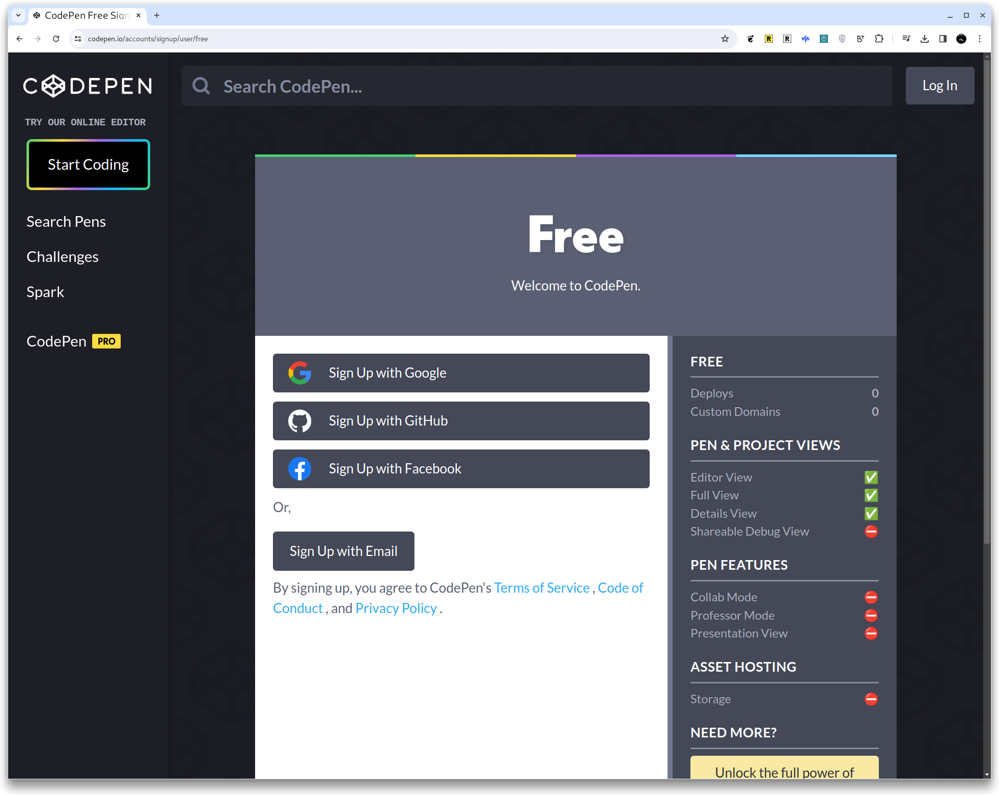
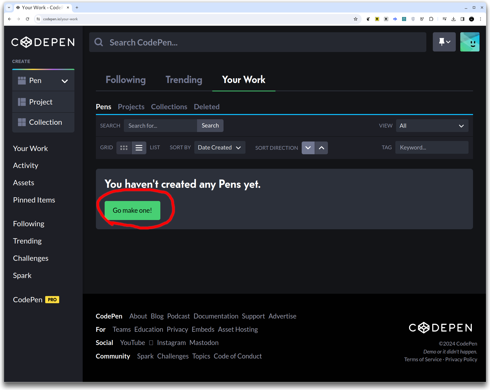
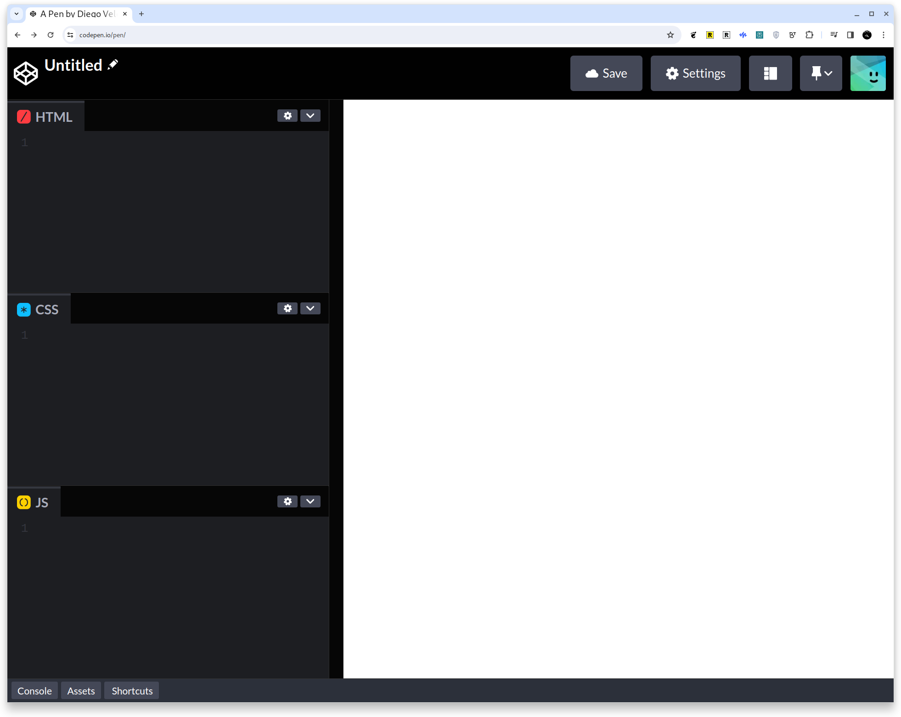
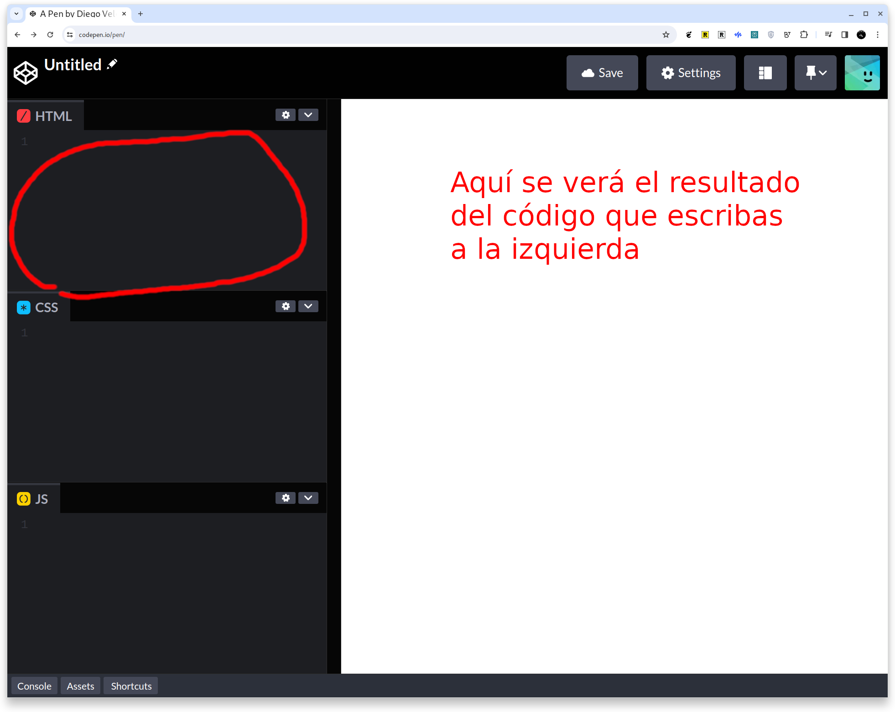
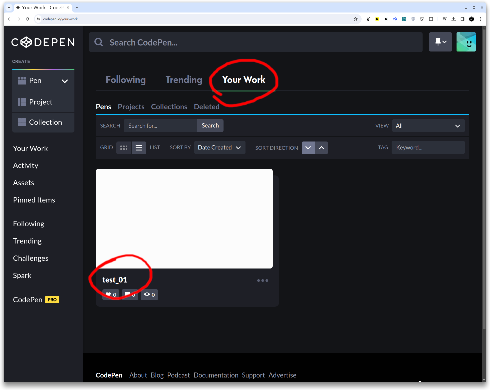
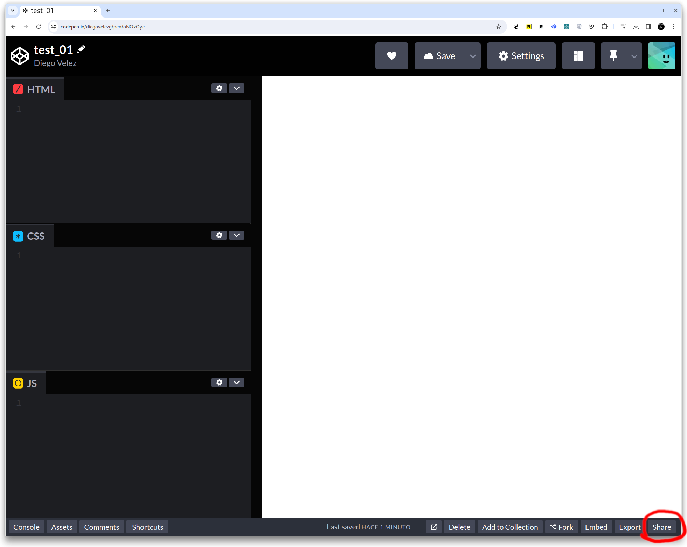
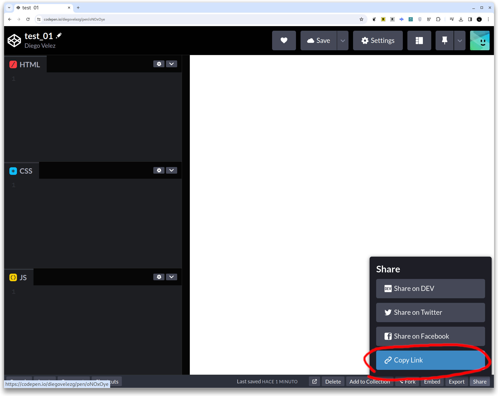

# CodePen

## Editores de código

Los editores de código son herramientas esenciales para cualquier persona que trabaje en el desarrollo y la programación de *software*. Estos editores están diseñados para facilitar la escritura y edición de código, ofreciendo características como resaltado de sintaxis, autocompletado y depuración de errores. Existen muchas opciones, desde simples editores de texto hasta entornos de desarrollo integrados (IDE) completos, cada uno con sus propias fortalezas y orientados a distintos niveles de experiencia y necesidades específicas.

Un Entorno de Desarrollo Integrado (IDE, por sus siglas en inglés) es una aplicación de *software* que proporciona a las desarrolladoras una suite completa de herramientas de programación en un solo paquete. Un IDE típicamente incluye un editor de código, herramientas de construcción y depuración, y a menudo integra gestores de control de versiones. Esto facilita no solo la escritura del código, sino también su prueba, depuración, mantenimiento, y colaboración con otras personas, todo en un solo lugar.

## CodePen

Para las principiantes, comenzar con herramientas innecesariamente complejas puede ser abrumador y contraproducente. Por eso, recomendamos iniciar con [CodePen](https://codepen.io/). CodePen es una herramienta en línea que permite a los usuarios experimentar con HTML, CSS y JavaScript directamente desde el navegador, sin la necesidad de instalar *software* adicional. Es ideal para aprender y probar código en tiempo real, con la ventaja de poder compartir tus proyectos y ver los de otras, lo cual es una excelente manera de inspirarse y aprender de la comunidad. A medida que ganes confianza y experiencia, podrás explorar editores de código más avanzados y descubrir cuál se adapta mejor a tus proyectos y estilo de trabajo.

### Crea tu cuenta

Anda al sitio de [CodePen](https://codepen.io/) y crea tu cuenta. Quizás te acomode crearla usando directamente tu cuenta de Google o Facebook. Así te evitas estar recordando una contraseña más :weary:. 

El único inconveniente es que no hay una versión en castellano ni portugués. Felizmente son pocos elementos de la interfaz con los que tendrás que lidiar. Acá te dejamos capturas de pantalla paso a paso para guiarte.

### Crea tu primer "Pen"

En CodePen, se le llaman "Pen" a un proyecto individual que consta de HTML, CSS, y JavaScript. Es básicamente un entorno de desarrollo en línea donde puedes escribir, probar y demostrar fragmentos de código.

Cuando estés lista para comenzar a "codear", crea tu primer "Pen" 

## Tu primer Pen

Así se verá tu primer "proyecto" completamente en blanco.

Ponle un nombre para que te sea fácil identificar qué harás acá.

> En CodePen, no necesitas vincular manualmente los archivos de HTML, CSS y JS porque la plataforma lo hace automáticamente por ti. Sólo tienes que escribir el código correspondiente en cada una de las cajas de código (HTML, CSS, JS) en su interfaz. CodePen se encarga de combinar y mostrar el resultado en tiempo real.
> 
> Esto es una simplificación que nos permite COdePen y por eso te proponemos comenzar con esa herramienta. Luego, cuando decidas trabajar en otro(s) editor(es) de código como VS Code, tú deberás encargarte de hacerlo en el código.

### HTML

Este espacio es donde escribirás tu código HTML

### CSS

Y acá escribirás tu código CSS.

### Guarda tu primer "Pen"

### Todos tus "Pens"

A partir de ahora, acá encontrarás todos los "Pens" que hayas creado.

### Comparte tu trabajo

Cuando quieras compartir tu trabajo para mostrar el resultado o pedir comentarios/ayuda de alguna compañera :sunglasses:, debes obtener el enlace/*link* al "Pen" con el botón "share" (compartir).

Una vez hayas copiado el enlace con el botón "Copy/link", puedes pegarlo en donde necesites para que tras personas puedan acceder a ver tu trabajo.

¡Listo! 🌟
