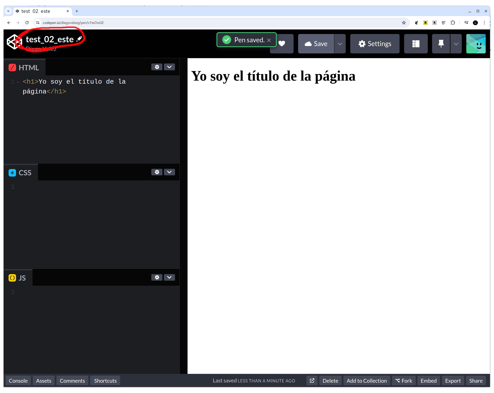
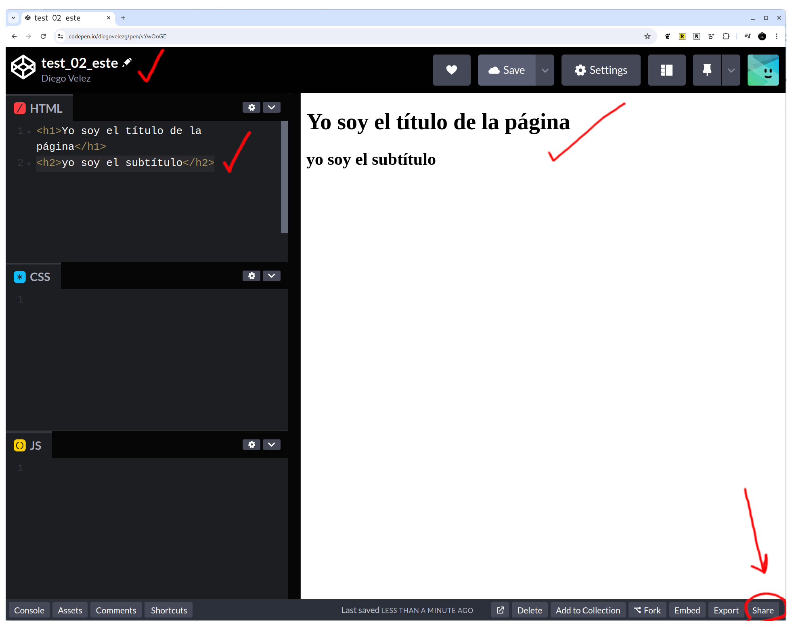

# CodePen, fork o bifurcación

## Explicación

En el contexto del desarrollo de *software*, el término "fork" se traduce al castellano como "bifurcación". Una bifurcación se refiere a la acción de copiar el código fuente de un proyecto de *software* para desarrollar una versión independiente del mismo. Esto permite a las desarrolladoras modificar y experimentar con el software sin afectar el proyecto original.

En nuestro caso, esto nos permitirá conservar una "instantánea" de tu trabajo en un punto determinado del tiempo y que puedas compartirlo en ese estado mientras sigues trabajando en una copia basada en el mismo (el fork).

## Paso a paso

1. Abre el proyecto o "Pen" del que quieres hacer la copia para seguir trabajando en ella. Busca y dale al botón "fork"

2. Asegúrate de cambiarle el nombre al proyecto para no confundirte. COdePen no lo hace por defecto (al menos no en el momento en el que creamos esta guía).

3. Ya puedes seguir trabajando en la copia basada en el proyecto original y, cuando lo necesites, puedes compartir la URL o enlace a esta nueva copia.

Una vez hayas copiado el enlace con el botón "Copy/link", puedes pegarlo en donde necesites para que tras personas puedan acceder a ver tu trabajo.

¡Listo! 🌟
