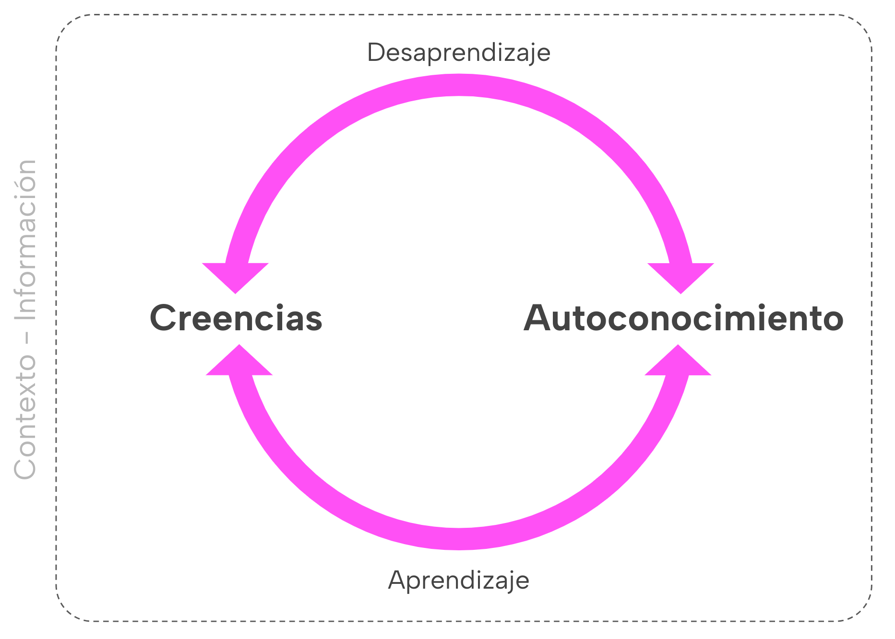

# Nuestro enfoque

**Tiempo :** :stopwatch: 15min

La manera torpe de abordar este desafío sería hacer un curso para cada habilidad,  darte ejercicios, un *quiz* para cuantificar tu nivel de competencia y hacer un *ranking* de mejores y peores. Ridículo, ¿no?. 

Esto ignora el contexto en el que se desenvuelven estas habilidades. Puede ser que esta semana estés durmiendo muy mal y tu desempeño no sea el que quisieras y puede ser que mañana te toca colaborar con una compañera con la que te entiendes rápidamente y todo fluye de maravilla. Puede ser que para un tema o actividad, tu desempeño sea uno y, al mismo tiempo, en otro tipo de actividad, sea otro. No se te ocurriría promediarlo, ¿verdad? Es decir, es algo dinámico pero no solamente en el sentido lineal-ascendente sino que fluctuante.

**Te proponemos un cambio de paradigma desde la “calificación” de habilidades hacia el auto-conocimiento basado en la observación y reflexión constantes.**

## Pilares

### Creencias

Desde pensar que el desarrollo del cerebro es fijo, que “no puedo” aprender tal o cual cosa, que las mujeres tal y los hombres tal otra, etc. Que el aprendizaje es lineal, que las calificaciones son una buena manera de representar el aprendizaje, que es “justo” que todas aprendamos lo mismo y al mismo tiempo, etc. Te invitamos a discutir y revisar muchas de estas creencias para ir construyendo ideas nuevas.

Conceptos asociados: neuroplasticidad y “Mentalidad de Crecimiento”, autoeficacia, sesgos, carga cultural, género, etc.

### Autoconocimiento (meta-habilidad)

El autoconocimiento (*self-awareness*) no solamente es un componente de la metacognición consciente sino que también puede ser visto como un resultado de la misma. Es la habilidad de examinar y entender quiénes somos en relación al dinámico mundo que nos rodea, nos permite controlar nuestro comportamiento y ajustar nuestras creencias, no solamente sobre nosotras mismas, sino que más importante aún, entre individuos.

Conceptos asociados:  introspección, juicio/criterio, pensamiento crítico, autopercepción (sesgos inconscientes), propósito, *self-awareness*. metacognición. 

## Premisas sobre las habilidades

1. Esto no es ingeniería, es solamente una aproximación. Comenzamos reconociendo que es inútil aspirar a la exactitud.

2. Aunque por necesidad presentemos las habilidades organizadas de alguna manera, lo cierto es que no son aspectos discretos, todas se interrelacionan y no son excluyentes. Lo hacemos así porque tenemos limitaciones cognitivas que nos imposibilitan representar algo de tal complejidad con precisión.

3. Evolucionan muy lentamente. Se requiere cambios de hábitos, de percepciones, entendimientos, personas, contextos, etc. No depende solamente de saber: “sé lo que es el pensamiento crítico, ergo lo puedo tener”. 

4. Para cada persona, la relevancia de cada una de las habilidades será distinta. Dependerá de tu personalidad, historia/experiencia, contexto, necesidades, preferencias, etc. 

### Foco en algunas habilidades

Te proponemos esta lista acotada de habilidades para observar.

**INICIATIVA**: Defines, priorizas y completas tareas sin supervisión directa. Participas preguntando y opinando. Eres diligente, tomando el control de tu proceso e intentas solucionar los problemas o situaciones sin necesidad de directrices explícitas.

**PLANIFICACIÓN, ORGANIZACIÓN Y MANEJO DEL TIEMPO**: Es capaz de estructurar una “ruta”, identificar dependencias y posibles impedimentos. Logras priorizar y organizar tu trabajo de forma adaptativa en lugar de intentar “predecir”.

**COMUNICACIÓN EFICAZ**: Articulas y transmites preguntas, pensamientos e ideas con claridad y facilitando el diálogo (oral o escrito). Incluye tu capacidad de escucha activa y la adecuación del mensaje pudiendo interactuar respetuosamente y de manera constructiva con personas de diferentes orígenes y perspectivas.

**COLABORACIÓN Y TRABAJO EN EQUIPO**: Reconociendo y respetando la diversidad de las personas, eres capaz de trabajar de manera efectiva con ellas para alcanzar objetivos comunes. Implica la disposición para compartir recursos y responsabilidades con el fin de lograr más de lo que sería posible individualmente.

**PENSAMIENTO CRÍTICO:** Se refiere a tu capacidad de analizar información y argumentos de manera objetiva y razonada, para formular juicios independientes y fundamentados. Implica cuestionar supuestos, evaluar la validez de diversas fuentes de información, identificar posibles sesgos, y desarrollar conclusiones propias. 

**SOLUCIÓN DE PROBLEMAS**: Utilizas tu conocimiento, habilidades y tu capacidad de leer el contexto para crear un procedimiento que resuelva un problema desconocido. No se refiere a aplicar una solución conocida para un problema conocido.

**APRENDER A APRENDER**: Adquieres continuamente nuevos conocimientos y habilidades. Eres capaz de identificar tus propias necesidades de aprendizaje y gestionar estableciendo objetivos, encontrando y utilizando recursos eficazmente, y evaluando críticamente tu propio progreso.

---

> 💬 [**Comenta en Discord:**](https://discord.com/channels/1209273049304666113/1237453097484292168)
> 
> - ¿Qué piensas del enfoque que te proponemos?
> - ¿Hay alguna experiencia que quieras compartir en la que se evidencia la importancia de estas habilidades?

---
