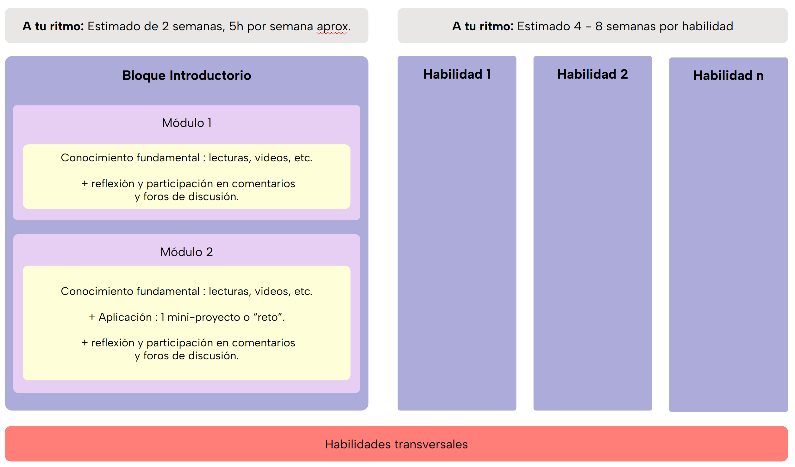
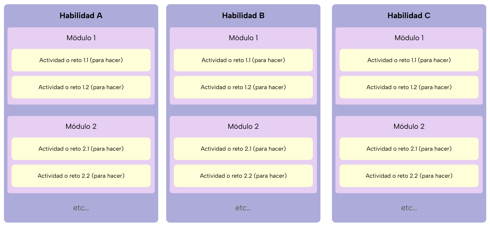

# ¿Cómo voy a aprender?

**Tiempo :stopwatch: :** 15min

> :headphones: Recuerda que puedes usar la extensión de [Speechify](https://speechify.com/es/extension-de-chrome/) o cualquier otra para escuchar la narración del texto en lugar de leerlo.

## Contexto

Sabemos que embarcarse en aprender algo nuevo puede ser un gran desafío, especialmente cuando no estás segura de cuánto interés o afinidad tienes en un área específica, ni cómo se alinea con tu contexto actual, ni qué nivel de aprendizaje realmente quieres o necesitas. 

Quizás solamente buscas informarte un poco de las oportunidades de la **economía digital**, compartir ideas y experiencias en comunidad con otras mujeres. Quizás te sirve aprender a usar algunas herramientas para mejorar tu actual trabajo, automatizar procesos, etc. Quizás tienes claro que quieres un cambio radical de carrera y quieres en dar ese primer paso de aprendizaje.

En todos los casos eres bienvenida porque hemos diseñado la experiencia de manera que se adecue a cada persona. :smile:

Te proponemos una experiencia de aprendizaje introductorio en la que puedes participar desde simplemente asistir a eventos en vivo, *online* o presenciales, con ponencias sobre diversos temas relacionados a las oportunidades para acceder y participar efectivamente de la economía digital.

### Plataformas, materiales y sesiones en vivo.

Aunque siempre te alentaremos a expandir y profundizar por tu cuenta, todo el "material" **mínimamente indispensable** para tu aprendizaje, en forma de lecturas, videos, diagramas, etc. lo encontrarás en este sitio. Por otro lado, todas las interacciones las tendremos en Discord, incluyendo eventos especiales, ayuda y colaboración entre compañeras, conversaciones, discusiones, y las sesiones en vivo de ayudantía con el equipo de Laboratoria.

Seguramente te resultará mucha información para comenzar pero te irás acostumbrando poco a poco.

## Estructura

### Bloque introductorio

Para cada área o "campo" técnico te ofrecemos un bloque introductorio diseñado para darte una visión clara y concreta, en un formato flexible y con poco compromiso de tiempo. 

> En tan solo 2 semanas, dedicando un máximo de 5 horas por semana a tu propio ritmo, explorarás los aspectos introductorios de cada disciplina de tu elección. Puedes explorar y probar todo lo que quieras.

Este enfoque te permite sumergirte sin la presión de un compromiso largo, ideal para descubrir si tu interés inicial se convierte en habilidades concretas o simplemente en un conocimiento valioso para tu crecimiento personal y profesional.

Este bloque no sólo te informará, sino que te motivará a reflexionar sobre cómo estas disciplinas impactan en la vida diaria de las personas y cómo podrías integrarlas en tu futuro. El bloque concluye con un "reto" o "mini-proyecto" que te dará la oportunidad de poner en práctica algo de lo aprendido para que puedas entender si es algo que quisieras continuar aprendiendo. 

Es tu oportunidad de explorar libremente, con la mente abierta y sin la presión de una decisión o compromiso a largo plazo. ¿Lista para comenzar el viaje? :rocket:

### Desarrollo de habilidades

Si después de completar el bloque introductorio, quieres continuar aprendiendo sobre eso, te encontrarás con que hemos agrupado todo en función de **habilidades concretas** de cada área. Así, para cada habilidad, te encontrarás con módulos que cubren aspectos específicos de la habilidad, y retos o actividades que es lo que irás completando poco a poco para conseguir desarrollar la habilidad indicada.

Encontrarás todo organizado de la siguiente manera. Es como una *matrioshka* o muñeca rusa 🪆. Las habilidades funcionan como un "contenedor" de módulos y los módulos como "contenedores" de actividades de todo tipo y/o retos que es lo que tendrás que "hacer" o ir completando.

---

#### :large_blue_circle: Habilidad (H)

Una habilidad es una destreza para ejecutar o hacer algo concreto. Puedes comprender los conceptos de gravedad, velocidad, equilibrio, etc., pero eso no significa que tengas **la habilidad de andar en bicicleta**.

La habilidad es esa capacidad práctica de aplicar lo que sabes, o incluso lo que intuyes,  para lograr hacer algo efectivamente: andar en bicicleta. Este es nuestro objetivo último, que puedas desarrollar habilidades que te permitan hacer cosas de verdad, en la practica, y que eso te permita acceder a más y mejores oportunidades.

Una habilidad se desarrolla **completando todas las actividades y los retos de todos los módulos que se incluyen en cada habilidad**. 

---

#### :large_blue_diamond: Módulo (M)

Los módulos son un “contenedor” de varias actividades y retos agrupamos para:

- Intercalar temas de aprendizaje:
  
  - Queremos evitar que se vuelva aburrido hacer mucho de lo mismo.
  
  - Aumentar la complejidad gradualmente: la complejidad de lo que irás aprendiendo es mayor que la suma de sus partes, entonces queremos ir combinando unas cosas con otras poco a poco.

- Darte algo de perspectiva para que tengas una referencia un poco más "grande" o "general" de cuánto vas aprendiendo.

---

#### :small_blue_diamond: Reto o "actividad" (R)

En Laboratoria, desde hace años creemos firmemente en el aprendizaje activo y en  "aprender haciendo" (*learning by doing*).

Te encontrarás con algunas **actividades** que te piden reflexionar/opinar/compartir sobre algo de lo aprendido.

Por otro lado, los **retos** son el principal vehículo de aprendizaje y los puedes entender como mini-proyectos. Cada uno es 100% autocontenido, es decir que indica lo que debes conseguir hacer y, además, contiene todos los insumos para adquirir el conocimiento necesario y ponerlo en práctica.

Cada reto aborda una sola meta de aprendizaje, pero es posible que haya más de un reto para una misma meta de aprendizaje. La finalidad de esto es que practiques más de una vez una misma meta si así nos parece necesario.

---

### Pongamos todo junto en un ejemplo

Supongamos que te quieres convertir en ciclista (esta sería el área o "campo"). Para conseguirlo, deberás completar pasos intermedios que te llevarán, poco a poco, a la construcción y desarrollo de las habilidades necesarias. El área o campo se vería algo así:

##### Bloque introductorio

###### **Módulo 1:**

Información y contexto general. Las actividades son del tipo lecturas, vídeos, reflexión, participación en comentarios y foros de discusión.

Definición clara y precisa de lo que implica aprender a andar en bicicleta ¿Qué problemas se busca resolver?, ¿para qué sirve en la vida cotidiana de la gente?, ¿cuáles son las perspectivas de futuro?, ¿cuáles son las herramientas, tecnologías o métodos clave que se utilizan? 

###### Módulo 2:

Conocimiento fundamental. Las actividades son del tipo lecturas, vídeos, reflexión, participación en comentarios y foros de discusión + 1 reto práctico o mini-proyecto que contiene el 100% de todo lo necesario para completarlo. 

**Reto: Equilibrio 1**. 

En este reto tienes la meta de aprender a mantenerte en equilibrio con la bicicleta en la misma posición alternando el apoyo en un pie o el otro durante 1 minuto o más. 

Tendrás una guía y recursos de conocimiento fundacional como inercia, gravedad, posibles lesiones, etc. Tendremos sesiones de ayudantía en vivo con el equipo de Laboratoria para que puedas resolver dudas o pedir ayuda. No son clases.

Para terminar, te daremos una pauta para que puedas evaluar tu propio aprendizaje y, si quieres, puedes pedir evaluación de alguna compañera también.

Si llegas solamente hasta acá está totalmente OK. Quizás probaste algo que hace tiempo querías y no te parece que tengas afinidad o que se alinee con tu contexto actual.

---

Si quieres continuar, pasarías directamente al desarrollo de una primera habilidad.

##### **Habilidad**: andar en bicicleta en la ciudad.

- **Módulo 1**: avanzar 100 metros en línea recta sin perder los dientes ni los anteojos.
  
  - **Reto 1.1 - Equilibrio:** en este reto tienes la meta de mantener el equilibrio sin pedalear y solamente con el impulso de alguien que te ayude.
  
  - **Reto 1.2** - **Romper la inercia**: en este reto tienes la meta de aprender a pedalear para arrancar y frenar cuidadosamente para detenerte. 
  
  - **Reto 1.3 - Frenar balanceando el freno delantero y el trasero**: la meta es aprender a frenar más con el freno trasero para evitar irte de narices hacia adelante.

- **Módulo 2**: dar una vuelta completa a una plaza o parque con rectas y curvas.
  
  - Reto 2.1 - Tomar curvas: ....
  
  - etc.

##### **Habilidad**: ciclismo de montaña....

Ya se entiende mejor, ¿verdad? 

---

> - :question: Plantea tus dudas por *chat* en el [canal #general de Discord](https://discord.com/channels/1209273049304666113/1209273050076291097)
> 
> - :mega: 💬 Si quieres abrir una discusión, puedes hacerlo en el [foro de aprendizaje transversal en Discord](https://discord.com/channels/1209273049304666113/1217834825260601407)

---
