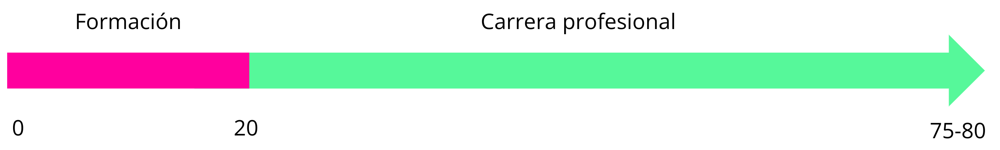
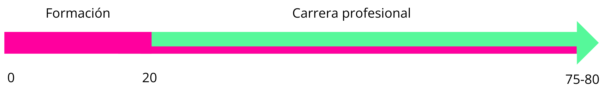

# La transformación del trabajo y las oportunidades

**Tiempo :stopwatch: :** 15min

---

> :headphones: Recuerda que puedes usar la extensión de [Speechify](https://speechify.com/es/extension-de-chrome/) o cualquier otra para escuchar la narración del texto en lugar de leerlo.

---

La naturaleza del trabajo ha cambiado y seguirá cambiando radicalmente. Todos los días nacen y desaparecen productos y servicios alrededor del mundo que compiten entre sí, y junto con ellos, se crean y destruyen millones de empleos. Las tendencias, modas, mercados, tecnologías, los lenguajes de programación y las metodologías de diseño e innovación, etc., cambian constantemente y los empleos que se basan únicamente en la ejecución de tareas rutinarias están en proceso de permanente  desaparición (y cada vez más rápido).

La educación “industrial” del sXX funcionó muy bien para proveer de “fuerza laboral“ hasta hace unas décadas, cuando el mundo estaba lleno de trabajos que permanecían sin cambios por largos períodos de tiempo. Adquirías conocimiento de una carrera o disciplina y listo, para toda la vida. Esa realidad está completamente extinta y no importa si te dedicas a la docencia, a la tecnología, la medicina, la filosofía, la agricultura, el arte, etc., la situación se repite y "no se puede tapar el sol con un dedo".

### Así se entendía el aprendizaje en el pasado

### Así se entiende hoy en día

Este nuevo paradigma ha incrementado la demanda de habilidades permanente o transversales como el pensamiento crítico, la solución de problemas complejos y la adaptabilidad. Es por eso que la filosofía de aprendizaje de Laboratoria se basa en la necesidad de que desarrolles ese tipo de habilidades, con especial énfasis en tu habilidad de aprender a aprender como herramienta principal para desempeñarte en cualquier empleo presente y futuro porque todo está y estará en constante transformación.

### Para carreras especializadas

Bien sea que te quieras dedicar enteramente al **desarrollo web**, al **análisis de datos** o al **diseño de experiencias de usuario**, etc. vas a necesitar estas habilidades para poder trabajar efectivamente y para aprender permanentemente si es que quieres mantener tu empleo o conseguir otro. Una simple búsqueda en Google sobre la importancia del aprendizaje continuo y las habilidades transversales o del sXXI, te dará cualquier claridad que te falte. Esto no es un asunto de opiniones, son realidades concretas y tangibles.

### Como "*skills stacking*" o "*citizen developer*"

En el contexto de la transformación laboral profundamente marcada por lo digital que comentamos antes, emergen los conceptos de "*skills stacking*" (apilamiento de habilidades) y de *citizen developer*" (ciudadana desarrolladora).

No necesariamente querrás aprender **habilidades digitales** para que esa sea tu profesión. Por la razón que sea, ese puede no ser un camino que se ajuste a tu contexto, necesidades, potencial o gustos. Sin embargo, hay otras maneras en las que adquirir estas habilidades puede significar que tengas acceso a más y mejores oportunidades de empleo y desarrollo profesional.

#### *Skills stacking*

El "apilamiento de habilidades" consiste en adquirir y combinar habilidades de diversos campos para formar un conjunto de capacidades únicas y que resultan en algo más que la suma de sus partes. 

Ser superespecialista en algo específico es muy difícil, y no siempre es la mejor estrategia para ser versátil y valiosa en diferentes contextos y empleos. Al cultivar un conjunto diverso de habilidades, puedes adaptarte más fácilmente a cambios en las demandas del mercado, aprovechar nuevas oportunidades y navegar con éxito por carreras que son cada vez más dinámicas y no lineales.

Por ejemplo, alguien que trabaja en un almacén manejando un inventario, podría beneficiarse enormemente al desarrollar habilidades básicas de análisis de datos. En algunos casos podría acceder a alguna vacante ya existente o, incluso, demostrar  beneficios para la empresa al aplicar sus nuevas habilidades y proponer la creación de un nuevo puesto al que pueda acceder. 

En esencia, el apilamiento de habilidades puede ser una inversión inteligente en el capital humano de una misma.

#### *Citizen developer*

Esta figura de "ciudadana desarrolladora" representa a personas sin formación formal, ni profunda, en programación o desarrollo de *software* que, gracias a plataformas de desarrollo de bajo código (*low-code*) o sin código (*no-code*), pueden crear soluciones digitales, integraciones, aplicaciones, automatizar tareas y contribuir significativamente a los objetivos digitales de sus organizaciones o emprendimientos. 

Estas personas se convierten en catalizadoras de la transformación digital, acelerando la implementación de soluciones tecnológicas que traen eficiencias muy atractivas para las empresas de todo tamaño. Esa capacidad de responder rápidamente a las necesidades cambiantes del mercado a través de soluciones tecnológicas innovadoras, de bajo costo y complejidad, se convierte en un diferenciador clave para conseguir y mantener un empleo. 

Así, no solo se está redefiniendo quién puede participar en el espacio tradicionalmente reservado para quienes hacían desarrollo de *software* de manera profesional, sino que también se está expandiendo la naturaleza misma del empleo en la era digital, subrayando la importancia de la habilidad demostrable por sobre el "certificado", y de la creatividad por sobre la convencionalidad.

Piensa la cantidad inmensa de trabajo manual que se hace en miles de empleos y podría ser perfectamente "automatizable" con un mínimo de habilidades digitales y con servicios de bajo costo que abundan en Internet. Actualizar planillas, documentos, envío de mensajes, concatenar procesos de unas plataformas o herramientas con otras, vuelve a las empresas y a las personas mucho más eficientes y libera su capacidad cognitiva de solución de problemas y creatividad para las que, por ahora, no hay tecnología que sustituya.

---

> :mega: 💬  [**Comenta en Discord:**](https://discord.com/channels/1209273049304666113/1215445879411052554) ¿Te parece una visión exagerada sobre el cambio del empleo?, ¿es algo que ya estás viviendo directamente?, ¿qué temores tienes al respecto?

--- 

Opcional si quieres profundizar por tu cuenta:

:seedling: [Reporte del Foro Económico Mundial]([Futuro del empleo 2023: Estos son los trabajos en los que más aumenta o disminuye la demanda | Foro Económico Mundial](https://es.weforum.org/agenda/2023/05/futuro-del-empleo-2023-estas-son-las-funciones-que-mas-crecen-y-las-que-mas-disminuyen/) sobre el futuro del empleo y las habilidades más requeridas por las empresas.

:seedling: En su libro "*Range: Why Generalists Triumph in a Specialized World*", de D. Epstein, argumenta que en un mundo hiperespecializado, las personas con amplios intereses y experiencias diversas (generalistas) a menudo tienen ventajas sobre los especialistas porque sobresalen en adaptabilidad, resolución de problemas complejos y pensamiento innovador.

----
