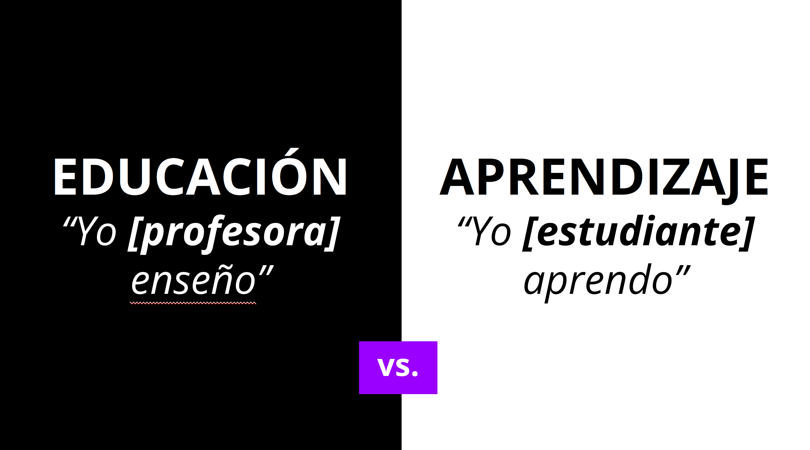
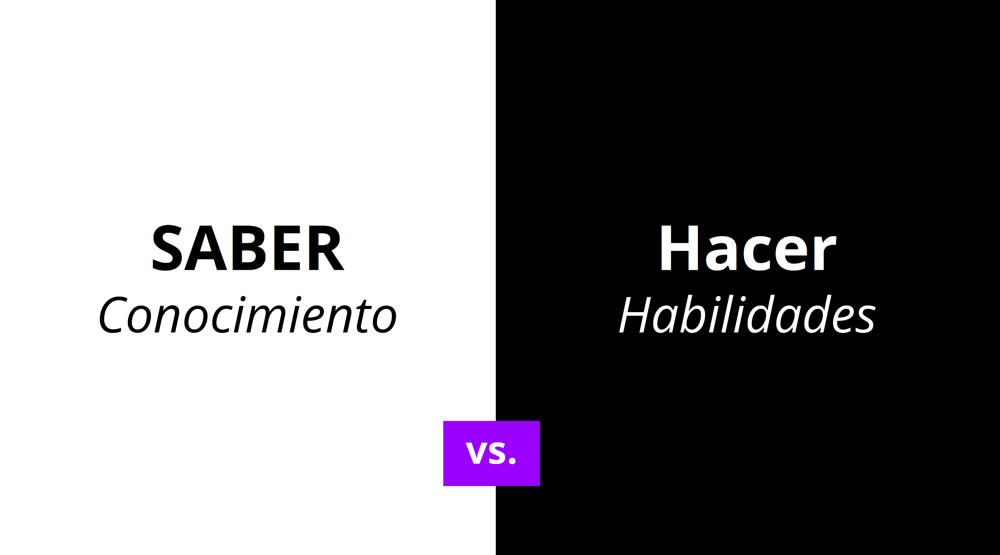
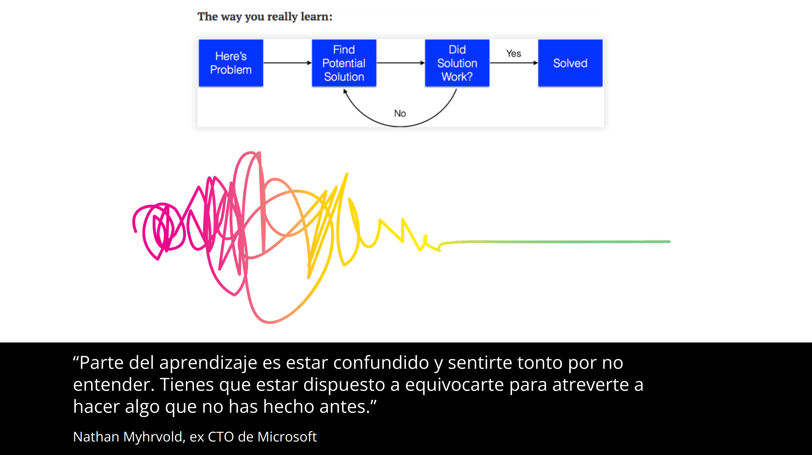
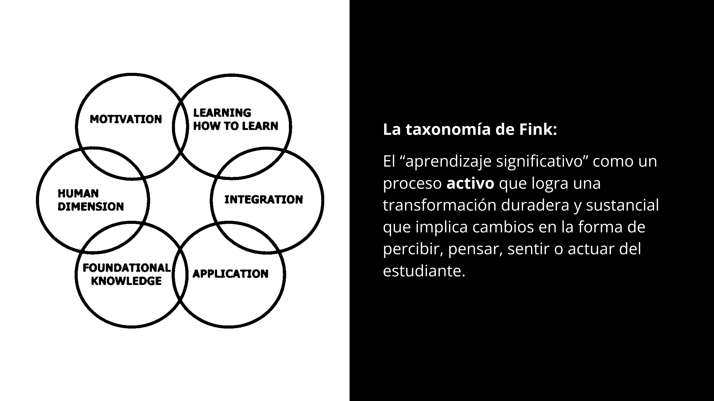

# Filosofía de aprendizaje

**Tiempo :stopwatch: :** 10min

A la gran mayoría nos "educaron"" para seguir instrucciones, a callar mientras un profesor hablaba y hablaba, a memorizar, sin saber por qué ni para qué, una lista de cosas que debíamos responder en un examen que cuantificaba nuestro “conocimiento” y que nos clasificaba en un *ranking* de mejores y peores, comparándonos como si fuéramos ladrillos idénticos; una atroz negación de nuestra infinita diversidad. **Nuestros talentos individuales quedaron, muchas veces, ocultos para siempre por estar “fuera de la norma”.**

## Tú, estudiante, eres el centro

Nuestra filosofía de aprendizaje cambia el tradicional paradigma de “yo te enseño” a “yo aprendo”. Ya hemos hablado de la importancia del desarrollo de habilidades de largo plazo como aprender a aprender para acceder a [trabajos que no están en desaparición](learning_model_work.md).

Sea cual sea el tiempo que pases aquí, esperamos que te lleves una experiencia que te sume para trabajar en entornos de incertidumbre en los se requiere aprender constantemente y adaptarse al cambio permanente, en lugar de planificar y ejecutar las mismas tareas. 

¿Por qué tenemos que aprender lo mismo a la misma vez?, ¿por qué no podemos  tomar decisiones conscientes sobre nuestro aprendizaje y hacernos cargo de ellas?, ¿qué tiene de extraordinario que cada quien aprenda a su ritmo?, ¿no es parte de la vida saber lidiar con que tenemos habilidades diferentes?, ¿no es la autonomía una habilidad esencial para trabajar y vivir?, ¿no es todo esto algo que deberíamos ejercitar tanto como podamos? Tú estás a cargo de tu propio aprendizaje.

## La única manera de aprender, es hacer lo que no sabes

Conocer algo no es lo mismo que tener una destreza para hacer algo. Saber de la ley de la gravedad y del movimiento no hace que sepas andar en bicicleta.

De la educación tradicional, muchas veces hemos quedado con la idea de que "recordar" para responder un cuestionario es lo más importante. Si bien eso puede ser valioso para muchos contextos y situaciones, aquí proponemos que eso son meros insumos para el **desarrollo de habilidades**. Buscamos que seas capaz de hacer algo concreto y real con lo que has aprendido, no solamente recordarlo hasta.... que se te olvide 😶.

Por eso, en lugar de que tengas "contenido" o "materia" que debes leer y memorizar para luego responder un cuestionario; el vehículo para desarrollar habilidades serán las **actividades** y **retos**. En cada caso encontrarás el requerimiento de lo que debes **conseguir hacer**, todos los insumos para adquirir el conocimiento necesario, ponerlo en práctica y evaluar tu propio trabajo. 

## Neuroplasticidad y mentalidad de crecimiento

Algunas décadas atrás, los científicos todavía pensaban que un cerebro maduro era “estático” y, por lo tanto, incapaz de cambiar. Hoy sabemos que nuestros [cerebros y sistemas nerviosos cambian constantemente](https://www.cognifit.com/es/plasticidad-cerebral), en función y forma, hasta que morimos; es un proceso dinámico de aprendizaje y adaptación en base a nuestras experiencias. Dos casos excepcionalmente demostrativos son: el cambio en tamaño del [hipocampo de conductores de taxi londinenses](https://www.ncbi.nlm.nih.gov/pubmed/17024677), que deben conocer y memorizar miles de calles, en comparación con conductores de autobuses que hacen siempre la misma ruta, y los [cambios de tamaño y forma en los cerebros de personas que comienzan a meditar](https://www.washingtonpost.com/news/inspired-life/wp/2015/05/26/harvard-neuroscientist-meditation-not-only-reduces-stress-it-literally-changes-your-brain/), en tan sólo 8 semanas. Ese cambio, no obstante, no es lineal ni predecible, es un proceso que requiere humildad, disciplina y paciencia.

Entender y aceptar que nuestros cerebros pueden cambiar es fundamental para convertirnos en aprendices de por vida. El trabajo de la psicóloga [Carol Dweck](https://es.wikipedia.org/wiki/Carol_Dweck) sobre el poder del “*growth mindset*” es uno de los más conocidos en este campo. “La mentalidad de crecimiento”, explica Dweck, “se basa en la creencia de que tus cualidades básicas son cosas que puedes cultivar mediante el esfuerzo, la estrategia y la ayuda de otros. Cuando aprendemos algo nuevo, nuestro cerebro cambia, hace nuevas conexiones y construye nuevos modelos mentales que aumentan nuestras capacidades.

No estamos diciendo que con esfuerzo y disciplina se puede conseguir “todo en la vida”, eso sería de una candidez temeraria o directamente pensamiento mágico. Por ejemplo, seguramente has escuchado o leído que para formar un nuevo hábito se necesitan 21 días, o que 10.000 horas de práctica “hacen al maestro”. Ese tipo de afirmaciones nos atraen porque simplifican una realidad extremadamente compleja y con la que es muy difícil lidiar. El problema con esas afirmaciones e ideas es que son solamente sobre-simplificaciones y [mitos](https://www.6seconds.org/2018/02/09/the-great-practice-myth-debunking-the-10000-hour-rule-and-what-you-actually-need-to-know-about-practice/). Hay investigaciones que, por ejemplo, determinan que [son 66 los días que se requieren para formar un hábito](https://jamesclear.com/new-habit), pero claro, son 66 en promedio; a ti te puede tomar 33 días y a mí 99… ¡¡y nos quedamos felices diciendo 66!! o 21, o algún otro promedio que disminuya nuestra ansiedad ante tanta incertidumbre y ambigüedad. Lo que sí estamos diciendo aquí, es que hay evidencia que apunta a que con algunas estrategias podemos lograr cambios que de otra manera serían más difíciles de conseguir.

## Aprendizaje significativo

Vas a dudar pero recuerda que el aprendizaje no es lineal. Te vas a sentir atascada, confundida, "tonta", frustrada, vas a querer salir corriendo y decir "esto no es para mí". Ten paciencia, confía en la manera que te proponemos para aprender. 

Si consigues sintonizar, te llevarás una experiencia transformadora.

Además, ¡no te olvides que estarás rodeada de mujeres con perfiles diversos que estarán aprendiendo también! Es fundamental la comunidad para conseguir un aprendizaje colaborativo y efectivo. 

## Preguntas frecuentes

---

:seedling: TBD

---
